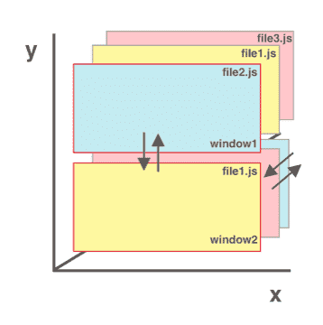

# *Buffers*, ventanas y pestañas

Si has utilizado un editor de texto moderno, probablemente estás familiarizado con las ventanas y las pestañas. Vim tiene tres abstracciones en vez de dos: *buffers*, ventanas y pestañas.

En este capítulo veremos cómo funcionan en Vim los *buffers*, ventanas y pestañas.

Antes de comenzar, debes asegurarte que la opción `set hidden` está presente en tu archivo `vimrc`. Sin este ajuste, cada vez que cambies a un *buffer*, Vim te pedirá que guardes el archivo (no quieres eso si quieres moverte rápidamente entre distintos *buffers*. Para más información, echa un vistazo a la ayuda de Vim `:h hidden`.

# *Buffers*

Un *buffer* es un espacio en la memoria en el que puedes escribir y editar algún texto. Cuando abres un nuevo archivo en Vim, su contenido estará ligado a un nuevo *buffer*:
  1. Dentro de Vim, abre un nuevo *buffer* con el comando `:new` (crea un nuevo *buffer vacío)
  2. Desde tu terminal, abre un nuevo archivo llamado `file1.js` (crea un nuevo *buffer* con `file1.js` ligado a el)

Si tu *buffer* no está ligado todavía a un archivo pero quieres guardar su contenido, puedes guardarlo mediante `:w </ruta/al/archivo>`.

```
vim file1.js
```


Lo que se muestra en la imagen anterior es el *buffer* del archivo `file1.js`. Cada vez que abrimos un nuevo archivo, Vim crea un nuevo *buffer*.

Sal de Vim. Esta vez, abre dos nuevos archivos:

```
vim file1.js file2.js
```


Vim muestra el *buffer* de `file1.js`, pero ha creado dos *buffers*: el buffer de `file1.js` y el *buffer* de `file2.js`. Puedes mostrar todos los *buffers* mediante el comando `:buffers` (como alternativa también puedes usar `:ls` o `:files`).


Hay varias formas de poder desplazarse por los *buffers*:
1. `:bnext` para ir al *buffer* siguiente (`:bprevious` para ir al *buffer* previo).
2. `:buffer` + nombre_de_archivo. Vim puede autocompletar el nombre de archivo con `tab`.
3. `:buffer` + `n`, donde `n` es el número del *buffer*. Por ejemplo, escribiendo: `:buffer 2` te llevará al *buffer* número 2.
4. Salta a la antigua posición en la lista de saltos con `Ctrl-o` y a la nueva posición con `Ctrl-i`. Estos no son métodos específicos para *buffers*, pero pueden ser utilizados para saltar entre diferentes *buffers*. Hablaremos más sobre los saltos en el capítulo 5.
5. Ir al *buffer* previamente editado con `Ctrl-^`.

Una vez que Vim crea un *buffer*, este permanecerá en tu lista de *buffers*. Para eliminarlo, puedes escribir `:bdelete`. También acepta un número de *buffer* (`:bdelete 3` para eliminar el *buffer* #3) o un nombre de archivo (`:bdelete` después utiliza `tab` para autocompletar el nombre).

La parte más difícil de aprender para mí sobre los *buffer* fue visualizar cómo funcionan. Una forma de hacerlo es imaginando mis *buffers* como un mazo de cartas. Si tengo 3 *buffers*, tengo una pila de 3 cartas. Si veo `file1.js` que se muestra en el *buffer*, entonces la carta de `file1.js` es la que está en la parte superior del mazo. No puedo ver las cartas `file2.js` ni `file3.js`, pero sé que están en el mazo de cartas. Si cambio el buffer a `file3.js`, estoy poniendo la carta de `file1.js` en el mazo y poniendo la carta de `file3.js` en la parte superior del mazo.

Si no has usado Vim anteriormente, este es un nuevo concepto. Tómate tu tiempo para entenderlo. Cuando estés preparado, movámonos a las ventanas.

# Ventanas

Una ventana es una división gráfica en un *buffer*. Puedes tener múltiples ventanas. La mayoría de los editores de texto tienen la posibilidad de mostrar múltiples ventanas. A continuación puedes ver una captura del editor VSCode mostrando 3 ventanas.


Abramos el archivo `file1.js` de nuevo desde la terminal:
```
vim file1.js
```


Anteriormente he dicho que estás viendo el *buffer* de `file1.js`. Aunque esto es correcto, es incompleto. Estás viendo el *buffer* de `file1.js` mostrado a través de **una ventana**. La ventana es el medio por el que estás viendo el *buffer*.

No abandones Vim todavía. Ejecuta:
```
:split file2.js
```


Ahora estás viendo dos *buffers* mediante **dos ventanas**. La ventana superior muestra el *buffer* `file2.js`. La ventana inferior muestra el *buffer* `file1.js`.

Por cierto, si quieres navegar entre ventanas, puedes utilizar estos comandos:

```
Ctrl-W h    Mueve el cursor a la ventana de la izquierda
Ctrl-W j    Mueve el cursor a la ventana inferior
Ctrl-W k    Mueve el cursor a la ventana superior
Ctrl-W l    Mueve el cursor a la ventana de la derecha
```

Ahora ejecuta:
```
:vsplit file3.js
```


Estás viendo tres ventanas mostrando tres *buffers*. La ventana superior izquierda muestra el buffer `file3.js`, la ventana superior derecha muestra el *buffer* `file2.js`, y la ventana inferior muestra el *buffer* `file1.js`.

Puedes tener múltiples ventana mostranto el mismo *buffer*. Mientras estás en la ventana superior izquierda, escribe:

```
:buffer file2.js
```


Ahora las dos ventanas superiores, tanto la izquierda como la derecha, están mostrando el *buffer* `file2.js`. Si comienzas a escribir en la superior izquierda, verás que el contenido de la superior izquierda y superior derecha está cambiando en tiempo real.

Para cerrar la ventana actual, puedes ejecutar `Ctrl-W c` o escribir el comando `:quit`. Cuando cierras una ventana, el *buffer* todavía permanece ahí (de nuevo, para ver los *buffers*, puedes utilizar `:buffers, :ls, :files`).

Aquí hay algunos de los comandos para las ventanas en el modo normal:
```
Ctrl-W v    Abre una nueva división vertical
Ctrl-W s    Abre una nueva división horizontal
Ctrl-W c    Cierra una ventana
Ctrl-W o    Hace que la ventana actual sea la única en la pantalla y cierra las demás ventanas
```
Y aquí hay una lista de los comandos para las ventanas:
```
:vsplit nombre_de_archivo    Divide la ventana verticalmente
:split nombre_de_archivo     Divide la ventana horizontalmente
:new nombre_de_archivo       Crea una nueva ventana
```

Para más información, echa un vistazo a la ayuda de Vim `:h window`. Dedícale un tiempo para entenderlos.

# Pestañas

Una pestaña en una colección de ventanas. Piensa en ello como en un diseño para ventanas. En la mayoría de los editores modernos (y en los modernos navegadores de internet), una pestaña significa un archivo/página abierta y cuando la cierras, el archivo/página desaparece. En Vim, una pestaña no representa un archivo abierto. Cuando cierras una pestaña en Vim, no estás cerrando un archivo. Recuerda, Vim almacena los archivos en la memoria mediante los *buffers*. Cerrar una pestaña (o una ventana) no hace que ese archivo desaparezca de los *buffers*.

Veamos las pestañas de Vim en acción. Abre `file1.js`:
```
vim file1.js
```

Para abrir `file2.js` en una nueva pestaña:

```
:tabnew file2.js
```


También puedes permitir que Vim autocomplete el archivo a abrir en una *nueva pestaña* presionando `tab`.


A continuación puedes encontrar una lista de navegaciones útiles por las pestañas:
```
:tabnew archivo.txt    Abre archivo.txt en una nueva pestaña
:tabclose              Cierra la pestaña actual
:tabnext            Ir a la próxima pestaña
:tabprevious        Ir a la pestaña previa
:tablast            Ir a la última pestaña
:tabfirst           Ir a la primera pestaña
```
También puedes ejecutar `gt` para ir a la siguiente pestaña (con Gt vas a la pestaña previa). También puedes pasar un número como argumento a `gt`, donde el número corresponde al número de la pestaña. Para ir a la tercera pestaña, ejecuta `3gt`.

Una ventaja de tener varias pestañas es que puedes tener diferentes disposiciones de ventanas en diferentes pestañas. Tal vez deseas que tu primera pestaña tenga 3 ventanas verticales y la segunda pestaña tenga un diseño de ventanas horizontal y vertical mixto. ¡Las pestañas son la herramienta perfecta para el trabajo!


Para arrancar Vim con múltiples pestañas, puedes ejecutar esto desde la terminal:
```
vim -p archivo1.js archivo2.js archivo3.js
```
# Moviéndote en 3D

Moverse entre ventanas es como viajar en dos dimensiones a través de los ejes X-Y en coordenadas cartesianas. Te puedes mover a la parte superior, derecha, inferior e izquierda con `Ctrl-W h/j/k/l`.


Moverse entre *buffers* es cini viajar a través del eje Z en coordenadas Cartesianas. Imagina que los *buufers* de tus archivos están alineados a través del eje Z. Puedes desplazarte por el eje Z un *buffer* cada vez con `:bnext` y `:bprevious`. También puedes saltar a cualquier coordenada en el eje Z con `:buffer nombre_de_archivo/número de buffer`.


Te puedes mover en un *espacio tridimensional* combinando los movimientos de ventanas y *buffer*. Te puedes mover a la parte superior, derecha, inferior o la ventana izquierda (navegación en ejes X-Y) con las teclas de navegación por ventanas. Como cada ventana contiene *buffers*, te puedes mover hacia adelante o hacia atrás (navigación en Z) con los movimientos de *buffer*.




# Utilizando los *buffers*, ventanas y pestañas de la manera más inteligente

Has aprendido cómo funcionan los *buffers*, las ventanas y las pestañas en Vim. Para utilizarlas de manera eficiente, necesitas entender para qué están diseñadas y utilizarlas en tu propia forma de trabajar. Cada persona tiene una manera diferente de trabajar, aquí tienes un ejemplo.

Yo utilizaría los *buffers* para abrir todos los archivos necesarios para realizar la tarea que queremos hacer. Esta tarea puede necesitar que abras siete o siete veces siete archivos en *buffers*, pero no importa porque Vim puede manejar muchos *buffers* antes de que empiece a ir lento. Además abrir muchos *buffers* no llena mi pantalla. Solo verá un *buffer* (asumiendo que solo tengo una ventana) cada vez y que puedo volar rápidamente a cualquier *buffer* que desee.

Yo utilizaría múltiples ventanas para ver múltiples *buffers* a la vez, normalment cuando tengo archivos que muestran las diferencias entre archivos, comparando código o siguiendo el flujo de un código. Normalmente no tengo más de tres ventanas abiertas a la vez porque mo pantalla estaría llena. Cuando termino, cierro cualquier ventana extra. Prefiero tener las mínimas venttanas posibles.

Utilizaría una pestaña para gestionar los código del lado cliente y una pestaña diferente para los códigos de *back-end*. Personalmente, no utilizo pestañas en mi forma de trabajo. Utilizo ventanas de [tmux](https://github.com/tmux/tmux/wiki) como sustituto de las pestañas de Vim. Mi flujo de trabajo con tmux es similar a la forma de trabajar de las pestañas en Vim. En vez de tener abiertas múltiples **pestañas de Vim** para cada contexto, yo abro **ventanas de tmux** (una ventana de tmux para código del lado cliente y otra ventana para código de *back-end*).

Mi forma de trabajar puede ser diferente de la tuya debido a tu forma de editar y eso está bien. Experimenta hasta descubrir tu forma de trabajar y encontrar qué es lo que mejor se adapta a ti.

