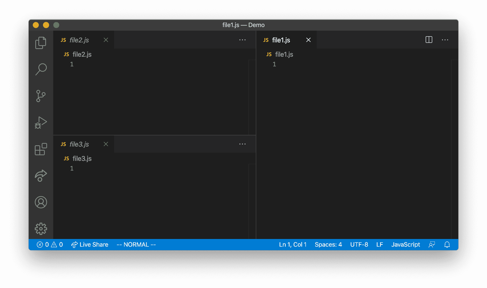
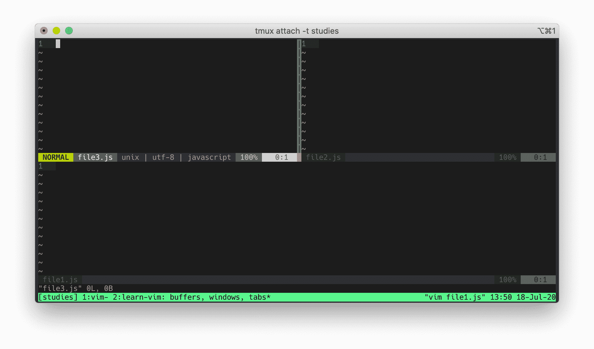
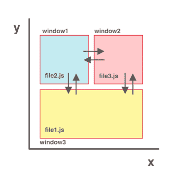

# *Buffers*, ventanas y pestañas

Si has utilizado un editor de texto moderno, probablemente estás familiarizado con las ventanas y las pestañas. Vim tiene tres abstracciones en vez de dos: *buffers*, ventanas y pestañas.

En este capítulo veremos cómo funcionan en Vim los *buffers*, ventanas y pestañas.

Antes de comenzar, debes asegurarte que la opción `set hidden` está presente en tu archivo `vimrc`. Sin este ajuste, cada vez que cambies a un *buffer*, Vim te pedirá que guardes el archivo (no quieres eso si quieres moverte rápidamente entre distintos *buffers*. Para más información, echa un vistazo a la ayuda de Vim `:h hidden`.

# *Buffers*

Un *buffer* es un espacio en la memoria en el que puedes escribir y editar algún texto. Cuando abres un nuevo archivo en Vim, su contenido estará ligado a un nuevo *buffer*:
  1. Dentro de Vim, abre un nuevo *buffer* con el comando `:new` (crea un nuevo *buffer vacío)
  2. Desde tu terminal, abre un nuevo archivo llamado `file1.js` (crea un nuevo *buffer* con `file1.js` ligado a el)

Si tu *buffer* no está ligado todavía a un archivo pero quieres guardar su contenido, puedes guardarlo mediante `:w </ruta/al/archivo>`.

```
vim file1.js
```


Lo que se muestra en la imagen anterior es el *buffer* del archivo `file1.js`. Cada vez que abrimos un nuevo archivo, Vim crea un nuevo *buffer*.

Sal de Vim. Esta vez, abre dos nuevos archivos:

```
vim file1.js file2.js
```


Vim muestra el *buffer* de `file1.js`, pero ha creado dos *buffers*: el buffer de `file1.js` y el *buffer* de `file2.js`. Puedes mostrar todos los *buffers* mediante el comando `:buffers` (como alternativa también puedes usar `:ls` o `:files`).


Hay varias formas de poder desplazarse por los *buffers*:
1. `:bnext` para ir al *buffer* siguiente (`:bprevious` para ir al *buffer* previo).
2. `:buffer` + nombre_de_archivo. Vim puede autocompletar el nombre de archivo con `tab`.
3. `:buffer` + `n`, donde `n` es el número del *buffer*. Por ejemplo, escribiendo: `:buffer 2` te llevará al *buffer* número 2.
4. Salta a la antigua posición en la lista de saltos con `Ctrl-o` y a la nueva posición con `Ctrl-i`. Estos no son métodos específicos para *buffers*, pero pueden ser utilizados para saltar entre diferentes *buffers*. Hablaremos más sobre los saltos en el capítulo 5.
5. Ir al *buffer* previamente editado con `Ctrl-^`.

Una vez que Vim crea un *buffer*, este permanecerá en tu lista de *buffers*. Para eliminarlo, puedes escribir `:bdelete`. También acepta un número de *buffer* (`:bdelete 3` para eliminar el *buffer* #3) o un nombre de archivo (`:bdelete` después utiliza `tab` para autocompletar el nombre).

La parte más difícil de aprender para mí sobre los *buffer* fue visualizar cómo funcionan. Una forma de hacerlo es imaginando mis *buffers* como un mazo de cartas. Si tengo 3 *buffers*, tengo una pila de 3 cartas. Si veo `file1.js` que se muestra en el *buffer*, entonces la carta de `file1.js` es la que está en la parte superior del mazo. No puedo ver las cartas `file2.js` ni `file3.js`, pero sé que están en el mazo de cartas. Si cambio el buffer a `file3.js`, estoy poniendo la carta de `file1.js` en el mazo y poniendo la carta de `file3.js` en la parte superior del mazo.

Si no has usado Vim anteriormente, este es un nuevo concepto. Tómate tu tiempo para entenderlo. Cuando estés preparado, movámonos a las ventanas.

# Ventanas

Una ventana es una división gráfica en un *buffer*. Puedes tener múltiples ventanas. La mayoría de los editores de texto tienen la posibilidad de mostrar múltiples ventanas. A continuación puedes ver una captura del editor VSCode mostrando 3 ventanas.



Abramos el archivo `file1.js` de nuevo desde la terminal:
```
vim file1.js
```


Anteriormente he dicho que estás viendo el *buffer* de `file1.js`. Aunque esto es correcto, es incompleto. Estás viendo el *buffer* de `file1.js` mostrado a través de **una ventana**. La ventana es el medio por el que estás viendo el *buffer*.

No abandones Vim todavía. Ejecuta:
```
:split file2.js
```


Ahora estás viendo dos *buffers* mediante **dos ventanas**. La ventana superior muestra el *buffer* `file2.js`. La ventana inferior muestra el *buffer* `file1.js`.

Por cierto, si quieres navegar entre ventanas, puedes utilizar estos comandos:

```
Ctrl-W h    Mueve el cursor a la ventana de la izquierda
Ctrl-W j    Mueve el cursor a la ventana inferior
Ctrl-W k    Mueve el cursor a la ventana superior
Ctrl-W l    Mueve el cursor a la ventana de la derecha
```

Ahora ejecuta:
```
:vsplit file3.js
```




Estás viendo tres ventanas mostrando tres *buffers*. La ventana superior izquierda muestra el buffer `file3.js`, la ventana superior derecha muestra el *buffer* `file2.js`, y la ventana inferior muestra el *buffer* `file1.js`.

Puedes tener múltiples ventana mostranto el mismo *buffer*. Mientras estás en la ventana superior izquierda, escribe:

```
:buffer file2.js
```


Ahora las dos ventanas superiores, tanto la izquierda como la derecha, están mostrando el *buffer* `file2.js`. Si comienzas a escribir en la superior izquierda, verás que el contenido de la superior izquierda y superior derecha está cambiando en tiempo real.

Para cerrar la ventana actual, puedes ejecutar `Ctrl-W c` o escribir el comando `:quit`. Cuando cierras una ventana, el *buffer* todavía permanece ahí (de nuevo, para ver los *buffers*, puedes utilizar `:buffers, :ls, :files`).

Aquí hay algunos de los comandos para las ventanas en el modo normal:
```
Ctrl-W v    Abre una nueva división vertical
Ctrl-W s    Abre una nueva división horizontal
Ctrl-W c    Cierra una ventana
Ctrl-W o    Hace que la ventana actual sea la única en la pantalla y cierra las demás ventanas
```
Y aquí hay una lista de los comandos para las ventanas:
```
:vsplit nombre_de_archivo    Divide la ventana verticalmente
:split nombre_de_archivo     Divide la ventana horizontalmente
:new nombre_de_archivo       Crea una nueva ventana
```

Para más información, echa un vistazo a la ayuda de Vim `:h window`. Dedícale un tiempo para entenderlos.

# Tabs

A tab is a collection of windows. Think of it like a layout for windows. In most modern text editors (and modern internet browsers), a tab means an open file/ page and when you close it, that file/page goes away. In Vim, a tab does not represent an open file. When you close a tab in Vim, you are not closing a file. Remember, Vim stores files in-memory via buffers. Closing a tab (or a window) does not make that file disappear from the buffers.

Let's see Vim tabs in action. Open `file1.js`:
```
vim file1.js
```

To open `file2.js` in a new tab:

```
:tabnew file2.js
```


You can also let Vim autocomplete the file you want to open in a *new tab* by pressing `tab` (no pun intended).


Below is a list of useful tab navigations:
```
:tabnew file.txt    open file.txt in a new tab
:tabclose           Close the current tab
:tabnext            Go to next tab
:tabprevious        Go to previous tab
:tablast            Go to last tab
:tabfirst           Go to first tab
```
You can also run `gt` to go to next tab page. You can pass count as argument to `gt`, where count is tab number. To go to the third tab, do `3gt`.

One advantage of having multiple tabs is you can have different window arrangements in different tabs. Maybe you want your first tab to have 3 vertical windows and second tab to have a mixed horizontal and horizontal windows layout. Tab is the perfect tool for the job!


To start Vim with multiple tabs, you can do this from the terminal:
```
vim -p file1.js file2.js file3.js
```
# Moving in 3D

Moving between windows is like traveling two-dimensionally along X-Y axis in a Cartesian coordinate. You can move to the top, right, bottom, and left window with `Ctrl-W h/j/k/l`.



Moving between buffers is like traveling across the Z axis in a Cartesian coordinate. Imagine your buffer files are lined up across the Z axis. You can traverse the Z axis one buffer at a time with `:bnext` and `:bprevious`. You can jump to any coordinate in Z axis with `:buffer filename/buffernumber`.


You can move in *three-dimensional space* by combining window and buffer movements. You can move to the top, right, bottom, or left window (X-Y navigations) with window navigations. Since each window contains buffers, you can move forward and backward (Z navigations) with buffer movements.


# Using Buffers, Windows, and Tabs the Smart Way

You have learned how buffers, windows, and tabs work in Vim. To use them efficiently, you need to understand what they are designed for and apply them in your own workflow. Everyone has a different workflow, here is one example.

I would use buffers to open up all required files to get the current task done. This task may require opening seven or seven times seven buffer files, but it doesn't matter because Vim can handle many buffers before it starts slowing down. Plus having many buffers opened won't crowd my screen. I am only seeing one buffer (assuming I have only one window) at any time and I can quickly fly to any buffer I wish.

I would use multiple windows to view multiple buffers at once, usually when diffing files, comparing codes, or following a code flow. I usually don't keep more than three windows opened at the same time because my screen will get crowded. When I am done, I would close any extra windows. I prefer having as few opened windows as possible.

I would use a tab to handle client-side codes and a separate tab for back-end codes. Personally, I do not use tabs in my workflow. I use [tmux](https://github.com/tmux/tmux/wiki) windows as substitute for Vim tabs. My tmux workflow is similar to Vim tabs workflow. Instead of having multiple **Vim tabs** opened for each context, I would have multiple **tmux windows** (one tmux window for client-side codes and another window for back-end codes).

My workflow may look different than yours based on your editing style and that's fine. Experiment around to discover your own flow and find what works for you best.

